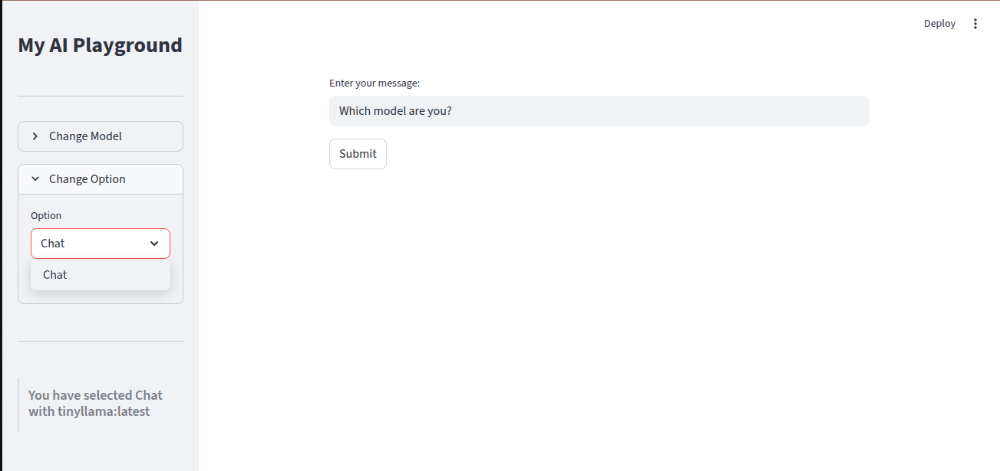

# MCP Data Agent - My Agentic AI Playground

MCP Data Agent is a modular, extensible project built on **Streamlit**, **LLMs (via Ollama)**, and **database connectors** to enable natural language interaction with data.  
It allows users to **query databases in plain English** and get back **streamed SQL queries and results in real time**.  

The project follows a **clean architecture** pattern, where each layer (UI, services, utils) is decoupled and easily extensible.  
It conforms to the **MCP Agent** design, making it adaptable for multiple backends and agents.

---

## 📂 Project Structure

```
mcp-data-agent/
├── app.py                  # Streamlit entry point
├── archive/main.py         # Old monolithic version (kept for reference)
├── config.py               # Centralized configuration
├── services/               # Core services layer
│   ├── agent.py            # Agent orchestration (SQL + LLM + DB)
│   ├── db_service.py       # Database connectivity and query execution
│   ├── ollama_service.py   # Ollama LLM service (streaming enabled)
├── ui/                     # UI layout components
│   └── layout.py           # Streamlit UI layout, input/output boxes
├── utils/                  # Helper functions and utilities
│   └── helpers.py
├── snapshots/              # Demo images for README
│   ├── DataAgent.png
│   ├── modelSelection.png
│   ├── optionSelection.png
│   └── streamingOutput.png
└── venv/                   # Virtual environment
```

---

## 🚀 Features

- **Natural Language to SQL**  
  Convert plain English queries into executable SQL using LLMs.

- **Real-time SQL Streaming**  
  Queries are displayed token-by-token as they are generated, mimicking a "typing effect".  
  

- **Database Integration**  
  - Modular `db_service.py` for managing DB connections.  
  - Easily extendable for multiple databases (Postgres, MySQL, Snowflake, etc.).

- **Model Selection**  
  Switch between LLM models for query generation.  
  

- **UI Controls**  
  Clean Streamlit UI with input box, dropdowns, and results display.  
  

- **Extensible & Modular**  
  Each responsibility is separated into a service/module:
  - `ollama_service.py` → Handles model calls  
  - `agent.py` → Orchestrates logic (LLM + SQL + DB)  
  - `db_service.py` → Database abstraction  
  - `layout.py` → UI rendering  
  - `helpers.py` → Utility functions  

- **Archived Monolithic Code**  
  `archive/main.py` contains the old single-file version for reference, showing how the project evolved to modular design.

---

## 🧩 How It Conforms to MCP Agent

The **MCP (Modular Conversational Processing) Agent** is about breaking down the conversational agent into **separable, pluggable components**:

1. **UI Layer (Streamlit - `ui/layout.py`)**  
   - Handles user interaction (inputs, dropdowns, results).  
   - Conforms to MCP principle of **separation of concerns**.

2. **Service Layer (`services/`)**  
   - `agent.py` → The **core MCP Agent**: takes input, invokes LLM, manages DB interaction, and streams SQL/output back.  
   - `ollama_service.py` → **LLM service** with streaming support.  
   - `db_service.py` → **Data service** for DB queries.  
   - Each service is swappable → aligns with MCP’s **pluggable services** design.

3. **Utils Layer (`utils/helpers.py`)**  
   - Common utilities (formatting, configs, etc.) reused across services.  
   - Matches MCP principle of **shared helper utilities**.

4. **Config (`config.py`)**  
   - Centralized configurations (DB URI, LLM model names, etc.).  
   - Makes the agent **environment-agnostic and reusable**.

---

## 🛠️ Extensibility

- **Add New Databases**  
  Implement a new handler in `db_service.py`.  
  Example: add `SnowflakeService` or `BigQueryService`.

- **Add New LLMs**  
  Extend `ollama_service.py` to support OpenAI, Anthropic, or local Hugging Face models.

- **Custom UI**  
  Add new input widgets in `ui/layout.py` (filters, checkboxes, table preview, etc.).

- **Plug into Pipelines**  
  The MCP Agent can be used as a module in Airflow, dbt, or custom ETL scripts for dynamic SQL generation.

---

## 🖼️ Screenshots

### Data Agent UI


### Model Selection


### Option Selection


### Streaming SQL Output


---

## ▶️ Getting Started

### 1. Clone Repo
```bash
git clone https://github.com/yourusername/mcp-data-agent.git
cd mcp-data-agent
```

### 2. Create Virtual Env
```bash
python3 -m venv venv
source venv/bin/activate
```

### 3. Install Dependencies
```bash
pip install -r requirements.txt
```

### 4. Run the App
```bash
streamlit run app.py
```

---

## 📌 Roadmap

- [ ] Add authentication & user roles.  
- [ ] Support multiple DB backends simultaneously.  
- [ ] Add natural language **data validation checks** (integration with Great Expectations).  
- [ ] Enable export of generated SQL queries.  
- [ ] Enhance streaming UX (syntax highlighting, query diff).  

---

## 📜 License

This project is licensed under the MIT License.  
See [LICENSE](LICENSE) for details.
