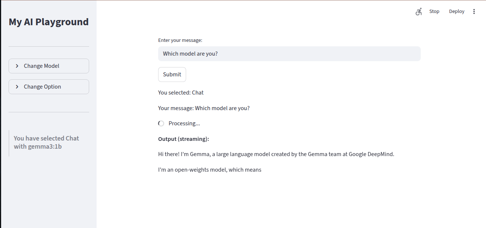
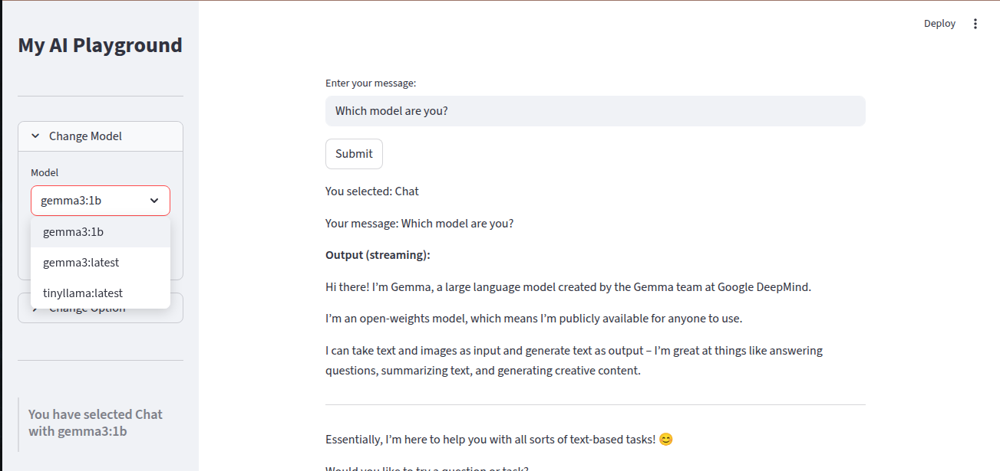
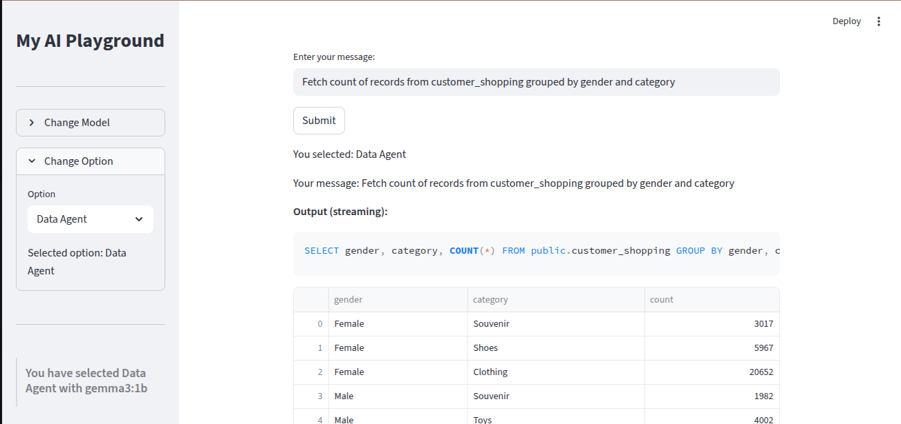

# My Agentic AI Playground

This project is a **Streamlit-based Agentic AI playground** that allows users to interact with AI models via two modes:

1. **Chat**
2. **Data Agent**

It demonstrates the integration of **Ollama models** for natural language understanding and shows a simplified **MCP-style agent** interacting with a local PostgreSQL database.

---

## Features

* Streamlit-based interactive UI
* Sidebar for selecting the **Ollama model** and **mode**
* Streaming responses from the model in Chat mode
* Data Agent mode for generating SQL from natural language and executing it on PostgreSQL
* Returns results in a formatted **pandas DataFrame**

---

## Installation

```bash
pip install streamlit requests pandas sqlalchemy psycopg2-binary
```

Make sure you have **Ollama** running locally and a **PostgreSQL database** available.

---

## How It Works

### 1. Chat Mode

* **Purpose**: Free-form conversation with the selected Ollama model.
* **Implementation**:

  * User input is sent directly to the Ollama model using the `stream_model_response` function.
  * The response is **streamed token-by-token** to the UI using a placeholder in Streamlit.
  * No external tools are used in this mode.
  
#### 📷  Snapshots
Snapshots are placed in the Snapshots folder
  
*Streaming Response from Model*

  
*Ability to change Model*


### 2. Data Agent Mode

* **Purpose**: Acts as an **MCP-style agent** that can query a PostgreSQL database based on natural language input.
* **Implementation Steps**:

1. **User Input**: The user enters a natural language query.
2. **Instruction / Context**: The input is wrapped in a system instruction that tells the model:

   ```text
   You are a Data Agent with access to a PostgreSQL database.
   Translate the following user request into a valid SQL query for PostgreSQL.
   Only return the SQL, no explanations.
   ```
3. **Agent (Ollama Model)**: Receives the combined user query and context. Generates SQL as the **agent's action**.
4. **Cleaning SQL**: The raw SQL from the model is cleaned to remove markdown code fences and comments to avoid syntax errors.
5. **Tool Invocation**: The cleaned SQL is executed on the PostgreSQL database via SQLAlchemy (`engine.execute`).
6. **Observation / Response**: The results are returned as a **pandas DataFrame**.
7. **Controller (Streamlit)**: The DataFrame is displayed in a formatted, scrollable table using `st.dataframe`.

#### 📷  Snapshots
  
*Data Agent Response*

### 3. MCP Terms Mapping

| MCP Concept                 | Your Implementation                                  |
| --------------------------- | ---------------------------------------------------- |
| Agent                       | Ollama model selected from the sidebar               |
| Tool                        | PostgreSQL database                                  |
| Context                     | Instruction string wrapping the user query           |
| Action / Tool Invocation    | Executing the SQL query on PostgreSQL                |
| Response / Observation      | DataFrame returned with query results                |
| Controller / Orchestrator   | Streamlit app handling input → agent → tool → output |
| Agent Prompt / Instructions | "Only return SQL, no explanations"                   |
| Model Context               | Ollama sees both the instruction and user query      |

### Notes on MCP Compliance

* This implementation follows the **spirit of MCP**: agent receives context + tools, generates action, executes, and returns observation.
* Currently, communication is via **raw prompts**, not structured JSON or RPC.
* For full MCP compliance:

  * Use **JSON messages**: `{ "tool": "postgres", "action": "execute", "query": "..." }`
  * Restrict agent actions explicitly to allowed tools.
  * Handle errors or unsafe queries in a structured manner.

---

## Streamlit Usage

1. Run the app:

```bash
streamlit run app.py
```

2. Use the sidebar to:

   * Select the Ollama model.
   * Choose between **Chat** and **Data Agent** modes.
3. Enter your query in the input box.
4. Click **Submit**.

* **Chat Mode**: Streams response token-by-token.
* **Data Agent Mode**: Returns a formatted DataFrame after executing SQL.

---

## Example Queries

**Chat Mode**:

```
Tell me a joke about data.
```

**Data Agent Mode**:

```
Show the first 5 rows of the customers table.
```

---

## Notes

* Ensure PostgreSQL credentials and database exist and are accessible.
* Ollama server must be running locally at `http://localhost:11434`.
* SQL cleaning removes markdown fences and comments to prevent syntax errors.
* The DataFrame display is scrollable and interactive in Streamlit.

---

## Future Improvements

* Full MCP-compliant messaging with JSON-RPC.
* Multi-tool support (e.g., calling APIs, file system tools).
* Streaming query results in Data Agent mode for real-time observation.
* Input validation and safe SQL execution to prevent harmful queries.

---

## 📄 License
MIT License. Free to use and modify.  
