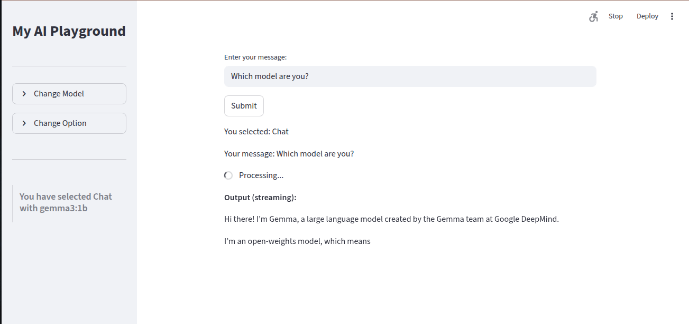

# MCP Data Agent

MCP Data Agent is a modular, extensible project built on **Streamlit**, **LLMs (via Ollama)**, and **database connectors** to enable natural language interaction with data.  
It allows users to **query databases in plain English** and get back **streamed SQL queries and results in real time**.  

The project follows the **Model Context Protocol (MCP)** principles, where services like **models, tools, and data connections** are exposed as pluggable modules.  
This makes the agent **discoverable, extensible, and interoperable** with any MCP-compliant client.

---

## 📂 Project Structure

```
mcp-data-agent/
├── app.py                  # Streamlit entry point
├── archive/main.py         # Old monolithic version (kept for reference)
├── config.py               # Centralized configuration
├── services/               # Core services layer
│   ├── agent.py            # Agent orchestration (SQL + LLM + DB)
│   ├── db_service.py       # Database connectivity and query execution
│   ├── ollama_service.py   # Ollama LLM service (streaming enabled)
├── ui/                     # UI layout components
│   └── layout.py           # Streamlit UI layout, input/output boxes
├── utils/                  # Helper functions and utilities
│   └── helpers.py
├── snapshots/              # Demo images for README
│   ├── DataAgent.png
│   ├── modelSelection.png
│   ├── optionSelection.png
│   └── streamingOutput.png
└── venv/                   # Virtual environment
```

---

## 🚀 Features

- **Natural Language to SQL**  
  Convert plain English queries into executable SQL using LLMs.

- **Real-time SQL Streaming**  
  Queries are displayed token-by-token as they are generated, mimicking a "typing effect".  
  

- **Database Integration**  
  - Modular `db_service.py` for managing DB connections.  
  - Easily extendable for multiple databases (Postgres, MySQL, Snowflake, etc.).

- **Model Selection**  
  Switch between LLM models for query generation.  
  

- **UI Controls**  
  Clean Streamlit UI with input box, dropdowns, and results display.  
  

- **Extensible & Modular**  
  Each responsibility is separated into a service/module:
  - `ollama_service.py` → Handles model calls  
  - `agent.py` → Orchestrates logic (LLM + SQL + DB)  
  - `db_service.py` → Database abstraction  
  - `layout.py` → UI rendering  
  - `helpers.py` → Utility functions  

- **Archived Monolithic Code**  
  `archive/main.py` contains the old single-file version for reference, showing how the project evolved to modular design.

---

## 🧩 How It Conforms to Model Context Protocol (MCP)

The **Model Context Protocol (MCP)** defines how models and tools expose themselves as services that can be discovered and invoked by a client.  
This project conforms to MCP by treating **models, tools, and DB access** as modular providers:

1. **Model Provider (`ollama_service.py`)**  
   - Exposes Ollama LLMs as MCP-compatible models.  
   - The client can **list available models** (via `/api/tags`) and dynamically select one.  
   - Aligns with MCP’s `models/list` capability.

2. **Tool Provider (`agent.py`)**  
   - Defines a **data agent tool** that accepts natural language and returns SQL queries/results.  
   - This is an MCP **tool**, callable by the client to perform structured operations (SQL generation + execution).  
   - Implements the MCP principle of tools being declarative, composable, and discoverable.

3. **Database Connector (`db_service.py`)**  
   - Acts as a **resource provider** (in MCP terms), allowing access to Postgres (and potentially other DBs).  
   - Queries are executed safely and returned in a structured format (DataFrame → JSON).  
   - Conforms to MCP’s separation of context (resources are independent from models/tools).

4. **Client/UI (`ui/layout.py`, `app.py`)**  
   - The Streamlit frontend is a thin client that **calls MCP services** (models, tools, DB).  
   - UI is separate from service logic, which matches MCP’s client/server boundaries.

By structuring the app this way, the project could **evolve into a full MCP server**, where `agent.py` and `ollama_service.py` expose endpoints for any MCP client (not just Streamlit).  

---

## 🛠️ Extensibility

- **Add New Databases**  
  Implement a new handler in `db_service.py`.  
  Example: add `SnowflakeService` or `BigQueryService`.

- **Add New Models**  
  Extend `ollama_service.py` to support OpenAI, Anthropic, or Hugging Face models.  
  These will appear as new MCP model providers.

- **Add New Tools**  
  Define more tools in `agent.py` (e.g., Data Validation, Data Summarization).  
  MCP clients can then **discover and call** them.

- **Custom UI**  
  Add new widgets in `ui/layout.py` for filtering, visualizations, or exporting results.

---

## 🖼️ Screenshots

### Data Agent UI


### Model Selection


### Option Selection


### Streaming SQL Output


---

## ▶️ Getting Started

### 1. Clone Repo
```bash
git clone https://github.com/yourusername/mcp-data-agent.git
cd mcp-data-agent
```

### 2. Create Virtual Env
```bash
python3 -m venv venv
source venv/bin/activate
```

### 3. Install Dependencies
```bash
pip install -r requirements.txt
```

### 4. Run the App
```bash
streamlit run app.py
```

---

## 📌 Roadmap

- [ ] Expose MCP endpoints for models/tools/resources.  
- [ ] Add authentication & user roles.  
- [ ] Support multiple DB backends simultaneously.  
- [ ] Add natural language **data validation checks** (integration with Great Expectations).  
- [ ] Enable export of generated SQL queries.  
- [ ] Enhance streaming UX (syntax highlighting, query diff).  

---

## 📜 License

This project is licensed under the MIT License.  
See [LICENSE](LICENSE) for details.
